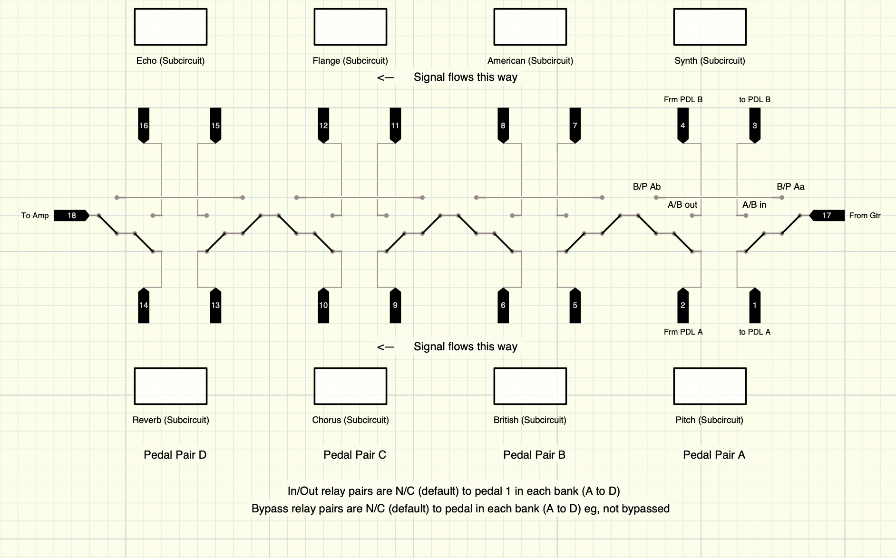

# Pedal Board Controller
## Introduction
The purpose of this project is to develop a guitar effects pedal switcher that brings the advantages 
of a multi effects unit to an array of discrete effects pedals, which any guitarist will tell you, 
sound better than most multifx systems. Lets not have that argument here &smile; Suffice to say, the 
primary disadvantage of a selection of custom effects pedals is a spasmodic dance when switching them in and out. The primaray advantage of a multi effect unit is being able to tap an **up** or a **down** button to run through a list of presets. This project aims to allow you to build a 2 path by 4 slot matrix switcher that brings the multi effects advantage to a custom pedal board of "hand 
chosen" "squash boxes."

Using almost any Arduino or other microcontroller and two 8x single pole, double throw relay modules 
it's possible to switch 2 rows of individually in and out of 3 slots. This shows the signal path...

The above shows, from "Pedal Pair A" to "Pedal Pair D", a slot for choice of 2 pitch or tracking pedals ("pitch" and "synth"), 2 drive pedals ("British" and "American", my Joyo drive pedals), 2 modulation pedals ("Chorus and "Flange") and 2 atmospherics/impulse pedals. ("Reverb" and "Echo") 
Each pair can be bypassed completely, too. There will also be a master bypass switch (not a relay) in case of logic failure.

Using a larger micro, such as a Mega2560, and more relay modules, it should be possible to switch pedals in up to 4 rows and 8 groups, although, for 99% of musicians, 4 by 2 should be more than enough. I run a 30 watt, Australian designed, Chinese built, class A tube amp, not unlike an AC30, so I don't need a dedicated impulse pair for amp simulation and, if I did, impulse modellers tend to already be digital and multimodel, so a single unit, after the switch chain would work for me, likewise signal conditioning at the beginning of the pedal chain.

The various pedal switching configurations will be stored in EEPROM, with location 0 being used to 
hold the current working state, updating it only when a change occurs. The aim is to verify any 
write and, if a write fails on the working memory location, the system will update to using "-1" and 
so on, which, of course, is 4095 for an Arduino Mega2560 or, for an Uno/Nano, is 1023.

Switch patterns will also be saveable to EEPROM as 20 banks of 20, from 21 to 420, leaving, 90 
locations (on Uno/Nano, ~3500 on Mega) for working memory and 19 locations reserved for other system 
values on 328p chips.

## How It Works

8 digital inputs, connected to 8 heavy duty, momentary pushbuttons, will be used to sense pedal 
pair bypass (front row of 4 buttons) and pedal selection. (rear row of 4) The buttons will be 
debonced by the EdgieD library and a button tap wil invert the state of the button's position in 
the liveBits[8] array. The liveBits[8] array states are output to 8 digital outputs to drive the 16 
relays (in pairs, forming a DPDT switch) to select/bypass each pedal/pair and 8 LEDs to indicate 
selection and bypass states, such that off = A and through, on = B and bypass, depending on the 
switch row, select or bypass. 5 other buttons will control bank up/down, memory up/down and store 
memory. 

On 328p Arduino boards, pins will be a bit of a juggle, as I2C will be needed to drive a display. I 
plan to use a MegaMini board, to make this easier, but using an UNO or Nano is doable. The display 
probably only needs to be an LCD0802 or LCD1602. Even a 7 segment LED is probably enough to display 
bank and memory.

## Construction and Layout

For me, the biggest advantage of this kind of system is being able to have the controller and pedals 
on a table, with a switch bank in a box on the floor. This will allow for switching program banks by 
foot operation, but tweaking actual pedal controls, while playing, without having to bend down to 
the floor. Having my pedals closer to eye level also helps as my eyesight is appalling these days! 
Even with glasses!

Using micros such as the ESP32 or ESP8266 would allow this kind of setup to be wireless. Button 
inputs and debouncing on the floor unit, relay outputs and EPROOM/Flash in the switching unit. The 
liveBits[8] array shared from the floor to the switch via Bluetooth. Having a unique ID for each 
build will allow multiple units to operate together, as the floor and swith modules can be 
programmed to respond only to their opposite part. This is beyond the scope of early development, 
but may well be doable in a later version or fork.